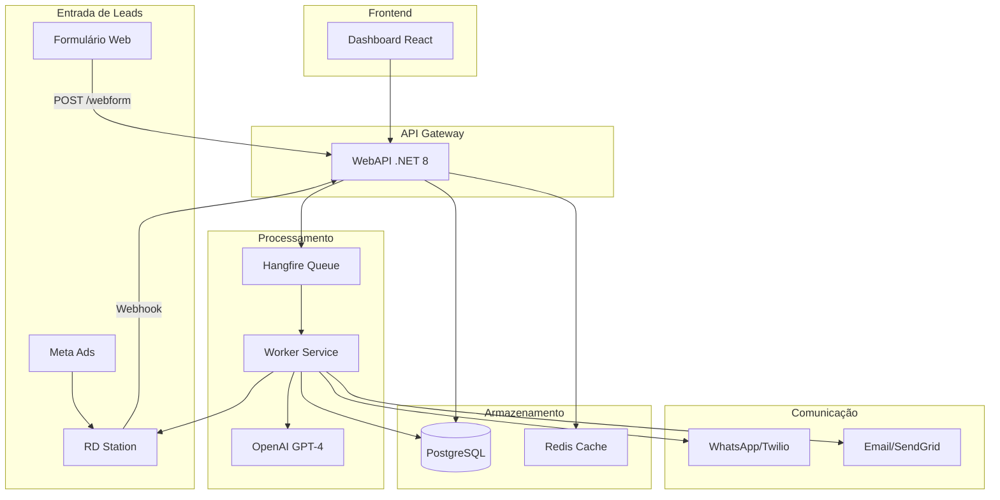

# Arquitetura LeadFlowAI

## Visão Geral



## Fluxo do Lead

```
┌─────────────────┐
│ Lead chega via  │
│ WebForm ou RD   │
└────────┬────────┘
         │
         ▼
┌─────────────────┐
│ Validação e     │
│ Normalização    │
│ (E.164, Email)  │
└────────┬────────┘
         │
         ▼
┌─────────────────┐
│ Deduplicação    │
│ (hash tel+tenant)│
└────────┬────────┘
         │
         ▼
┌─────────────────┐
│ Salvar DB       │
│ Status: RECEIVED│
└────────┬────────┘
         │
         ▼
┌─────────────────┐
│ Enfileirar      │
│ Qualificação LLM│
└────────┬────────┘
         │
         ▼
┌─────────────────┐
│ LLM analisa:    │
│ - Score 0-100   │
│ - Intenção      │
│ - Urgência      │
│ - Fit serviços  │
│ - Riscos        │
└────────┬────────┘
         │
         ▼
┌─────────────────┐
│ Guardrails      │
│ (regras         │
│ determinísticas)│
└────────┬────────┘
         │
    ┌────┴────┐
    │         │
    ▼         ▼
┌───────┐ ┌──────┐
│Handoff│ │Enviar│
│       │ │Resp. │
└───────┘ └──┬───┘
             │
             ▼
      ┌────────────┐
      │Sync RD     │
      │Station     │
      └────────────┘
```

## Camadas da Aplicação

### Domain (Core Business)
- **Entidades**: Lead, Tenant, LeadEvent
- **Enums**: LeadStatus, Intent, Urgency, LeadSource
- **Interfaces**: ITenantRepository, ILeadRepository
- **Value Objects**: TenantConfig, BusinessHours, FAQ

### Application (Use Cases)
- **Commands**: IngestWebFormLead, IngestRDStationLead, QualifyLead, SendLeadResponse
- **Queries**: GetLeadById, SearchLeads, GetLeadEvents
- **Handlers**: Processam commands/queries usando MediatR
- **DTOs**: Transferência de dados entre camadas

### Infrastructure (Implementações)
- **Persistence**: EF Core + PostgreSQL
- **Repositories**: Implementação das interfaces de domínio
- **Services**: LLM, WhatsApp, Email, RD Station
- **Background Jobs**: Hangfire para processamento assíncrono

### WebAPI (Presentation)
- **Controllers**: LeadIngestionController, LeadsController
- **Middleware**: JWT Auth, CORS, Error Handling
- **Configuration**: DI, Swagger, Hangfire Dashboard

### Worker (Background Processing)
- **BackgroundJobProcessor**: Processa jobs enfileirados
- **Retry Logic**: 3 tentativas com backoff exponencial
- **Logging**: Serilog para rastreabilidade

## Decisões Arquiteturais

### Por que Clean Architecture?
- ✅ Separação de responsabilidades
- ✅ Testabilidade (domain e application não dependem de infra)
- ✅ Facilidade para trocar tecnologias (ex: trocar PostgreSQL por SQL Server)
- ✅ Escalabilidade e manutenibilidade

### Por que MediatR (CQRS)?
- ✅ Desacoplamento entre controllers e lógica de negócio
- ✅ Commands e Queries explícitos
- ✅ Pipeline de behaviors (validação, logging, cache)
- ✅ Facilita testes unitários

### Por que Hangfire?
- ✅ Persistência de jobs no PostgreSQL (não perde jobs)
- ✅ Dashboard visual
- ✅ Retry automático
- ✅ Agendamento e jobs recorrentes
- ✅ Melhor que RabbitMQ/Kafka para este caso de uso

### Por que PostgreSQL?
- ✅ JSONB para campos dinâmicos (config, arrays)
- ✅ Full-text search (pg_trgm)
- ✅ Transações ACID
- ✅ Performance excelente
- ✅ Open source

## Segurança

### Em Trânsito
- HTTPS obrigatório (TLS 1.2+)
- JWT com HS256 e secret de 256 bits

### Em Repouso
- PostgreSQL com SSL
- Secrets em variáveis de ambiente (nunca no código)
- Masking de PII em logs

### LGPD/Compliance
- Logs de auditoria (lead_events)
- Retenção configurável
- Direito ao esquecimento (soft delete)
- Consentimento explícito

## Escalabilidade

### Horizontal (adicionar mais instâncias)
- ✅ API stateless (JWT)
- ✅ Worker pode ter N instâncias
- ✅ PostgreSQL com read replicas
- ✅ Redis para cache distribuído

### Vertical (otimizações)
- ✅ Índices otimizados no PostgreSQL
- ✅ Paginação em todas as queries
- ✅ Cache de configs de tenant
- ✅ Connection pooling

## Observabilidade

- **Logs**: Serilog (console + arquivo)
- **Métricas**: Hangfire Dashboard
- **Health Checks**: /health endpoint
- **Tracing**: Correlação de eventos por lead_id

## Próximos Passos

1. ⬜ Implementar autenticação completa (login, refresh token)
2. ⬜ Adicionar testes unitários e de integração
3. ⬜ Configurar CI/CD (GitHub Actions)
4. ⬜ Implementar rate limiting
5. ⬜ Adicionar circuit breaker para integrações externas
6. ⬜ Dashboard de métricas (tempo resposta, conversão, etc)
7. ⬜ Webhooks para notificar eventos para sistemas externos
8. ⬜ Multi-idioma (i18n) no frontend
9. ⬜ Testes A/B de mensagens
10. ⬜ ML para otimizar score dos leads
